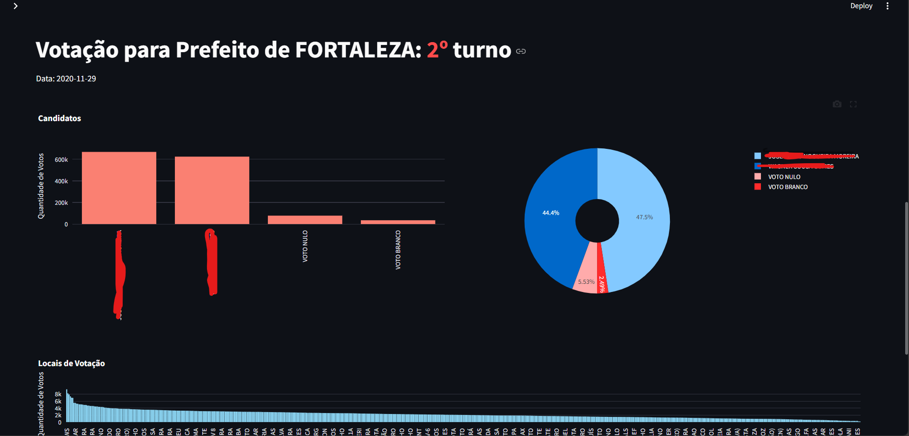

# Dashboard de Análise de Dados de Eleições Municipais

Este dashboard realiza a análise de dados de eleições municipais, trazendo estatísticas sobre votos de candidatos a vereadores e prefeitos.

## Fonte dos Dados

Os dados devem ser baixados do site do Tribunal Superior Eleitoral (TSE), os quais devem ser do tipo Votação por seção eleitoral, por estado e de eleições municipais:
- [Dados Abertos TSE](https://dadosabertos.tse.jus.br/dataset//resultados-{ano})

## Tecnologias Utilizadas

- Polars:  Biblioteca para leitura e manipulação de dados.
- Streamlit: Framework para construção de dashboards interativos em Python.
- Plotly Express: Biblioteca para criação de visualizações interativas.

## Funcionalidades

- **Análise por Município:** Seleção dinâmica de municípios para visualização dos resultados.
- **Filtros por Cargo e Candidato:** Visualização específica dos votos para prefeito ou vereador, e por candidato.
- **Visualizações Interativas:** Gráficos dinâmicos para análise detalhada dos resultados.

## Instruções de Uso

1. Instale as bibliotecas necessárias:
 - pip install streamlit plotly polars

2. Baixe os dados coloque na pasta e substitua o nome na linha 7 do arquivo streamlit_app.py
 
3. Execute o aplicativo Streamlit:
- python -m streamlit run streamlit_app.py

## Exemplo de Dashboard

